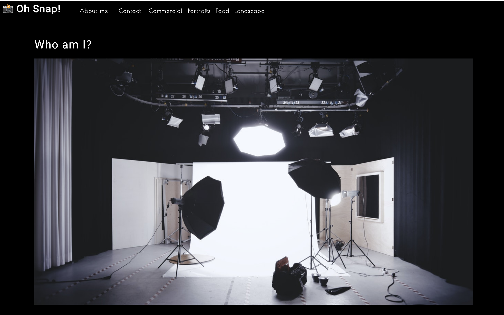

# Photo-Port

## Table-of-Contents

- [Description](#description)
- [Deployed Site](#deployed-site)
- [Features](#features)
- [Technologies](#technologies)
- [Future Development](#future-development)
- [Credits](#credits)

## Description

Photo Port is a React-based single page application (SPA) that uses react state, props, hooks, and reusable UI components to provide a simple yet sleek user experience. This webpage features a photographer's portfolio work, so that they can show off their work and reach more potential clients.

## Deployed Site

Follow [this link](https://ashlynn4567.github.io/Photo-Port/) to view and use my site!

## Features

This is how the webpage appears to viewers. It is responsive, adapting to multiple screen sizes.

This application is a single-page application (SPA), meaning that each section will conditionally render based off of the status of the virtual DOM. Instead of creating multiple HTML pages, there are reusable react components that appear based on what hte user currently has selected.

For example, if users click on the "contact" section, the gallery disappears. In the same way, clicking on any of the navigation links changes the view of the page without redirecting the webpage entirely. 

## Technologies

- CSS
- JavaScript
- React.js
- Jest-Dom

## Future Development

In the future, I would like to add the following improvements:

- Because of the way this application is deployed, the "Oh Snap" home link in the top left corner is not routed to the correct relative path. This bug needs fixed.
- I would like to figure out how to conditionally render the page so that the "About" section disappears when a gallery is selected, and the "Gallery" disappears when the about section is selected.
- I would like to adopt more styling features to this site so that users can interact more fully with each picture in the gallery.
- I would also like to adopt my own portfolio site that uses react components, state, and props to conditionally render a SPA similarly to this one.

I'm always interested in refactoring code to improve it's functionality. If you would like to suggest your own improvements, you can reach me at the links below.

- <a href="mailto:ashlynn4567@gmail.com">Email</a>
- <a href="https://github.com/ashlynn4567">GitHub</a>
- <a href="https://www.linkedin.com/in/ashley-lynn-smith/">LinkedIn</a>

## Credits

This project was built with the help of the University of Oregon's Coding Boot Camp.

## Licensing

The application is covered under the following license: [MIT](https://opensource.org/licenses/MIT)